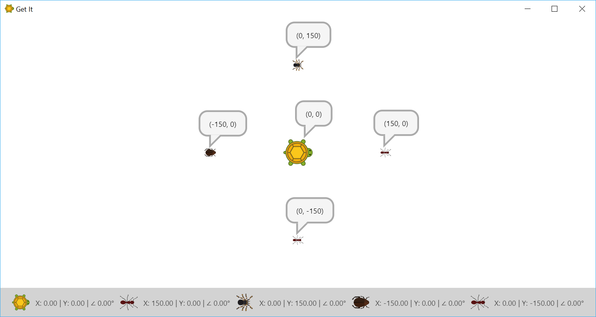

In this challenge you'll learn some basics of *Get It*. This includes the coordinate system of the scene, some simple commands to move around the turtle, the basics on how to use the turtle's pen and also how to insert breaks between commands.

1. Open `Program.cs`, create a new line after `Game.ShowSceneAndAddTurtle();` and start adding a command by typing `Turtle.`.
    > VSCode -- or any other editor with decent C# support -- will show a list of `Turtle` members -- functionality that is related to the turtle.
1. Choose `MoveInDirection`, invoke it by appending parentheses `()`, write the number of steps between the parentheses and finish the command with a semicolon `;`. The full command could look like this: `Turtle.MoveInDirection(200);`.
    > `MoveInDirection` is a *method*. A method can be invoked by appending parentheses `()`. A method can expect an arbitrary number of *parameters*. When invoking a method you have to provide exactly as many values to the method as there are parameters. The values you provide are called *arguments*. `MoveInDirection` for example expects a single parameter that defines the number of steps that the turtle should move. In the above example the value `200` is provided as argument.
1. Run the program with <kbd>F5</kbd> and check the turtle's position.
    > At the bottom you see a list of all players on the scene as well as their position and direction. The turtle starts at the center of the scene. Because the turtle by default looks to the right the command `Turtle.MoveInDirection(200);` should move the turtle to the position (200, 0).

    > *(200, 0)* is a position on a 2D surface (our scene). The X coordinate is `200` and the Y coordinate is `0`. The center of the scene is always at (0, 0). A negative X coordinate is on the left side of the scene, a positive X coordinate on the right side. A negative Y coordinate is on the bottom side of the scene, a positive Y coordinate on the upper side. The following screenshot shows some players and their current positions. 
1. I don't know about you, but I never saw a turtle moving that fast. This is because every command in a typical computer program is executed as fast as possible. But there is a command that pauses execution for a specific amount of time. Insert `Turtle.Sleep(1000);` before invoking `MoveInDirection` to let the turtle sleep for 1 second (1000 milliseconds).
    > The movement of the turtle still happens instantly, but now you can at least see that the position changes.
1. Try to change the argument of `MoveInDirection` so that the turtle moves 200 steps to the left.
1. Make yourself familiar with the commands `Turtle.RotateClockwise` and `Turtle.RotateCounterClockwise` by inserting multiple of them into your program and pausing execution between them. What's the physical unit of the methods' parameter? Kilograms? Seconds? Meters?
1. Now try to move the turtle so that it walks along a triangle by alternately moving and rotating the turtle. A triangle that fits on the scene and is *regular* gives bonus points. Add some pauses to verify that everything works as expected.
1. No matter how good you know turtles, you certainly didn't know that our turtle has a pen that can be turned on and off. The command to turn on the pen is `Turtle.TurnOnPen` and is simply invoked by appending `()` because it doesn't expect any parameters. However don't forget to finish the command with a semicolon `;`. Add the command before making the first move, run the program and be amazed by the fantastic triangle your turtle can draw.
1. Nicely done! Now change the program to draw a square and then a regular pentagon (five sides with equal length and equal angle).
